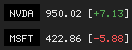

# stop

Stock position tracker for status bars



## Dependencies

- [yfinance](https://github.com/ranaroussi/yfinance)

## Installation

### Arch-based distributions

- [stop](https://aur.archlinux.org/packages/stop) is available in AUR.

## Configuration

Supported configuration options:

- custom ticker display value (legend)
- delay between checks
- colors:
    - background
    - foreground
    - ticker highlight
    - gain accent
    - loss accent
- plaintext mode
- one-shot mode
- decimal rounding
- historical difference:
    - daily: `[ .. ]`
    - weekly: `{ .. }`
    - monthly: `( .. )`
    - yearly: `< .. >`
- thousand separator
- custom padding
- custom URL opener

See `stop -h` for more info.

### Example polybar config

```ini
[module/stop]
type = custom/script
exec = stop NVDA MSFT
tail = true

label = %output%

click-left = kill -USR1 %pid%
click-right = kill -USR2 %pid%
```
